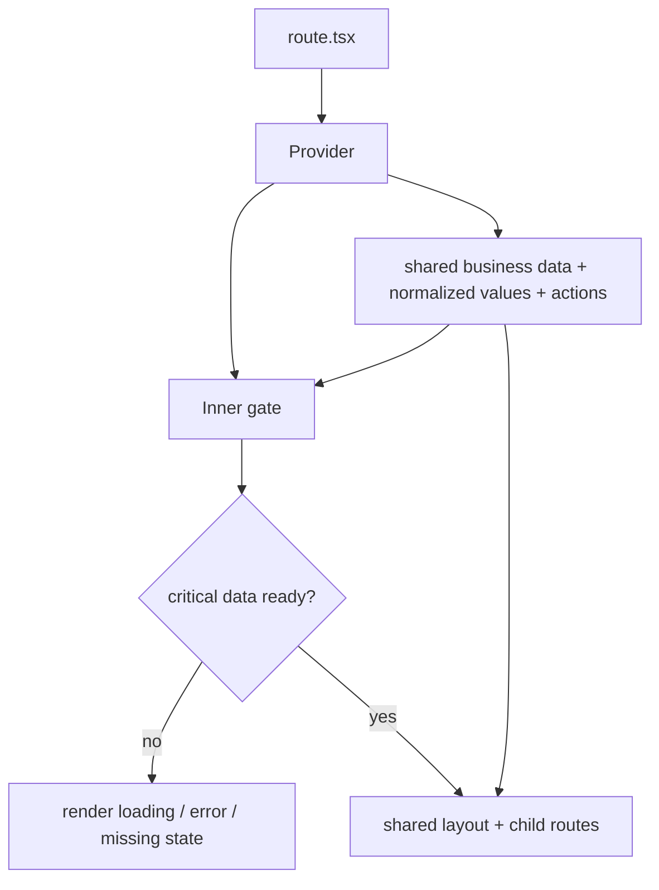

# AGENTS.md

## Overview

This repository is a reusable desktop app starter built with:

- Tauri 2 for the native shell and Rust backend
- React 19 + TypeScript for the frontend
- Vite 7 for bundling and dev server
- TanStack Router with file-based routing
- TanStack Query for async state and server-style caching
- Mantine 9 for functional UI components and theme
- Tailwind CSS v3 for layout and basic text styling
- `react-easy-provider` for app-level provider composition

Current frontend structure:

- `src/main.tsx`: app entry
- `src/router.tsx`: router setup
- `src/routes/`: file-based routes
- `src/components/layout/AppProvider.tsx`: app-wide providers and app UI state
- `src/components/layout/DefaultLayout.tsx`: shared shell layout
- `src/components/layout/AppHeader.tsx`: top-level navigation
- `src/components/layout/AppSettings.tsx`: settings modal entry
- `src/components/layout/settings/`: settings-related UI
- `src/components/layout/theme.ts`: Mantine theme setup
- `src/components/icon/semantic.tsx`: semantic icon aliases
- `src/lib/db/`: SQLite access layer
- `src/assets/styles/index.css`: global styles

Current native structure:

- `src-tauri/src/main.rs`: native entrypoint
- `src-tauri/src/lib.rs`: Tauri app builder and Rust commands
- `src-tauri/migrations/`: SQLite migrations
- `src-tauri/capabilities/`: Tauri permissions

## Environment

Recommended baseline on any device:

- Node.js 20+ or 24 LTS
- `pnpm` via Corepack
- Rust stable toolchain
- Tauri prerequisites for the target OS

On a fresh machine:

```powershell
corepack enable
pnpm install
cargo check --manifest-path .\src-tauri\Cargo.toml
```

## Run

Frontend only:

```powershell
corepack pnpm dev
```

Desktop app in Tauri:

```powershell
corepack pnpm dev:app
```

Generate route tree manually:

```powershell
corepack pnpm routes:gen
```

Production frontend build:

```powershell
corepack pnpm build
```

Desktop bundle:

```powershell
corepack pnpm build:app
```

## Frontend

### General Practices

- Prefer the `~` alias for `src` over deep relative imports.
- Prefer semantic icon names from `src/components/icon/semantic.tsx` over raw vendor icon names when the icon has app meaning.
- Put reusable internal helpers and integrations under `src/lib`.
- Put app-level business state in a dedicated provider created with `createProvider` from `react-easy-provider`.
- If a provider is internal-only, export the hook and keep the internal provider private to the module.
- Use TanStack Query for async work in components and follow normal query best practices: stable keys, clear loading and error states, and avoid ad-hoc effect-based fetching.
- Prefer small, composable components and route files over large page components.
- Keep one primary component per file and default-export it. Use named exports only for secondary helpers.
- For route components, prefer function declarations over arrow functions.
- Treat the current frontend structure outside `src/routes/todos.tsx` as the active baseline.
- Treat `src/routes/todos.tsx` mainly as a SQLite sample. Do not use it as the standard for newer frontend code.

Preferred component shape:

```tsx
import { FunctionComponent } from "react"

interface ComponentProps {}

const Component: FunctionComponent<ComponentProps> = () => {
  return null
}

export default Component
```

### i18n

- All user-facing strings go through `t()`. No hardcoded strings in components.
- Locale files live in `src/lib/i18n/locales/{locale}/app.json`.
- Group keys by feature area (`home.hero.title`, `settings.language`). Put repeated cross-feature strings under `common.*`.
- Use imperative, neutral tone for actions. No second-person address (`"Tạo dự án"` not `"Bạn hãy tạo"`).

#### How to use `t()` correctly

There are two contexts with different rules:

**Inside React components — use `useAppProvider()`:**

```tsx
const { t } = useAppProvider()
// t() is now reactive: re-renders automatically when locale changes
```

Do NOT call `useLocale()` manually in components. Do NOT import `t` directly from `~/lib/i18n` for rendering — the standalone `t` is not reactive and will not update on locale change.

**Outside components (form config, module-level code) — use `t` from `~/lib/i18n`:**

```ts
import { t } from "~/lib/i18n"

const form = defineConfig({
  name: { label: "common.name" }, // form's i18nConfig calls t() at render time
})
```

For `defineConfig` field labels, pass the key as a plain string — the form's `i18nConfig` in `src/components/form/index.tsx` calls `t()` internally. Do not wrap with `t()` at the call site.

#### Terms to keep in English (do not translate)

Domain and workflow terms that practitioners use in English regardless of locale:

- Workflow tabs: `Label`, `Train`, `Play`
- ML concepts: `Model`, `Class`, `Sample`, `Dataset`, `Epoch`, `Batch Size`, `Learning Rate`, `Validation Split`, `Accuracy`, `Loss`, `MobileNet`, `Transfer Learning`

Everything else should be translated, including `Project`, `Settings`, `Description`, and general UI copy.

### UI

- Use Tailwind for layout, spacing, flex/grid, sizing, positioning, and basic text styling.
- Use Mantine for functional UI components: forms, buttons, overlays, cards, navigation, inputs, app shell, and feedback states.
- For quick text color that needs to work across light and dark themes, prefer Mantine props like `c`, for example `Box c="dimmed"` or `Text c="orange.4"`.
- For quick animation and transition, prefer utility classes from `tailwindcss-motion`.
- Keep theme concerns in the layout provider and theme module, not scattered across route files.

### Routing

- Keep routes file-based under `src/routes`.
- Put shared shell layout in `src/routes/__root.tsx`.
- Do not edit `src/routeTree.gen.ts` manually.
- Prefer route params and nested routes over ad-hoc URL parsing.
- If routing types look stale, run `corepack pnpm routes:gen`.

#### Route Tree Providers

- For a route tree that shares one business entity or workspace context, lift all shared business data, derived state, and business actions into the highest practical provider in that tree.
- Do not duplicate child-route queries or repeat the same business shaping across the subtree.
- If the same calculation or rule appears more than once, consider to move it into the route-tree provider.

#### Route Tree Gating

- In a route tree, wrap the subtree with the provider at the route wrapper level, then gate critical loading, error, and missing-data states from a child component inside that provider.
- This usually means the route wrapper renders:
  1. the provider
  2. an inner gate component that consumes the provider
  3. the shared layout or child routes only after the critical data is ready
- Child pages inside that route tree should not reimplement loading or error handling for the same critical data.

#### Provider Output Shape

- Providers should expose normalized consumer-ready values for shared data.
- Prefer returning stable fallback values from the provider, for example:
  - strings as `""`
  - collections as `[]`
  - derived booleans as explicit `true` or `false`
- Child pages and nested components should consume provider values directly instead of repeatedly reading `query.data`.
- If a value is still optional by design, keep the fallback or optional access local, but prefer provider-level normalization first.



## Database

- Keep DB access in `src/lib/db`.
- Do not write SQL directly in route files.
- Keep migrations in `src-tauri/migrations`.
- Keep Tauri SQL permissions in sync with actual usage.
- Read `DB.md` for the database workflow, rationale, and current SQLite/Kysely setup.

## Backend

- Keep Rust commands narrow and explicit.
- Validate inputs at the Tauri boundary.
- Keep desktop-only system logic in Rust or official Tauri plugins when that boundary is clearer than frontend-only code.

## Multi-Device Notes

- Prefer `corepack pnpm ...` in docs and scripts if a machine may not have global `pnpm` wired yet.
- If `tauri dev` or `tauri build` fails on a new machine, check OS-specific Tauri prerequisites first before changing app code.
- Prefer running `.\scripts\bootstrap.ps1` right after cloning this starter into a new app.
- If Node, Rust, or Tauri versions differ across devices, verify with:

```powershell
node -v
corepack pnpm -v
rustc -V
cargo -V
```

## Editing Rules

- Keep files ASCII unless there is a real need for Unicode.
- Avoid unnecessary comments.
- Prefer clear file names and predictable route names.
- When cloning this repo into a new app, update package name, product name, Tauri identifier, and app title before shipping.
- When adding a new screen, prefer:
  1. a new file in `src/routes`
  2. route-local UI in that file first
  3. extraction only after a real second use case appears
